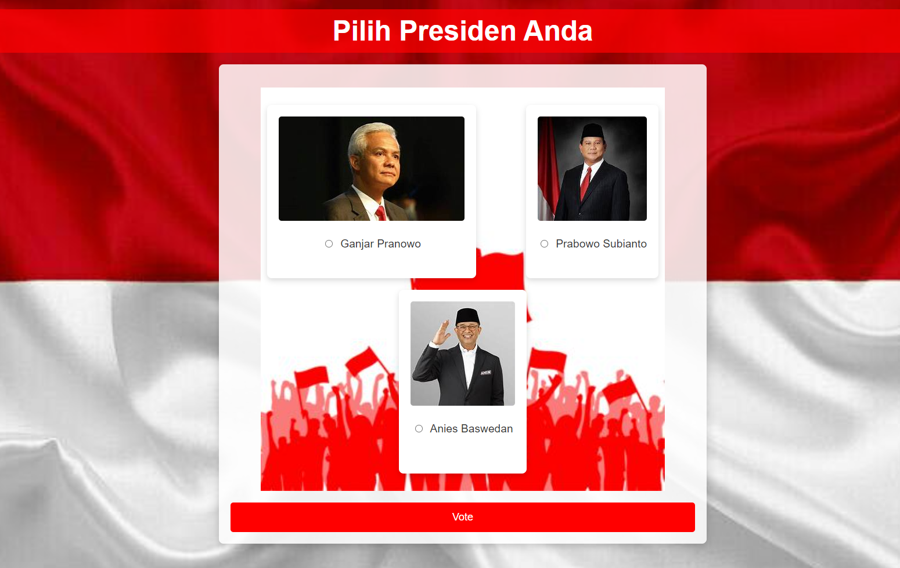

# Aplikasi Voting

Ini adalah aplikasi voting sederhana yang dibangun dengan PHP dan SQLite untuk mensimulasikan sistem voting. Pengguna dapat memilih kandidat pilihan mereka, dan hasil voting dapat dilihat secara real-time.

## Fitur
- Pengguna dapat memilih salah satu dari kandidat yang tersedia.
- Jumlah suara diperbarui secara langsung di basis data.
- Halaman hasil voting untuk melihat total suara dari masing-masing kandidat.
- Desain UI yang sederhana dengan tema nasionalis (Republik Indonesia).

## Teknologi yang Digunakan
- **PHP**: Digunakan untuk logika di sisi server.
- **SQLite**: Basis data ringan untuk menyimpan hasil voting.
- **HTML/CSS**: Digunakan untuk struktur dan gaya antarmuka pengguna.

## Lisensi
Proyek ini bersifat open-source dan bebas digunakan untuk tujuan pendidikan. Tidak ada lisensi resmi yang diterapkan.

---

 

**Catatan**: Aplikasi ini adalah simulasi voting dan tidak boleh digunakan untuk pemilihan resmi. Implementasi ini bersifat dasar dan ditujukan untuk tujuan pembelajaran.
